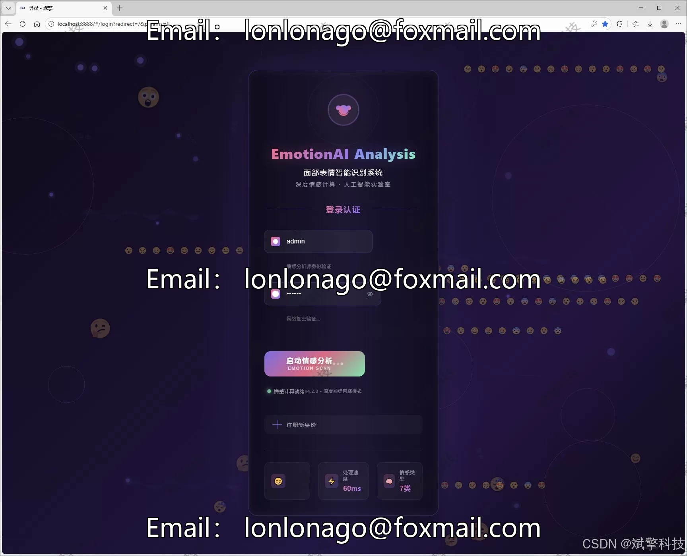
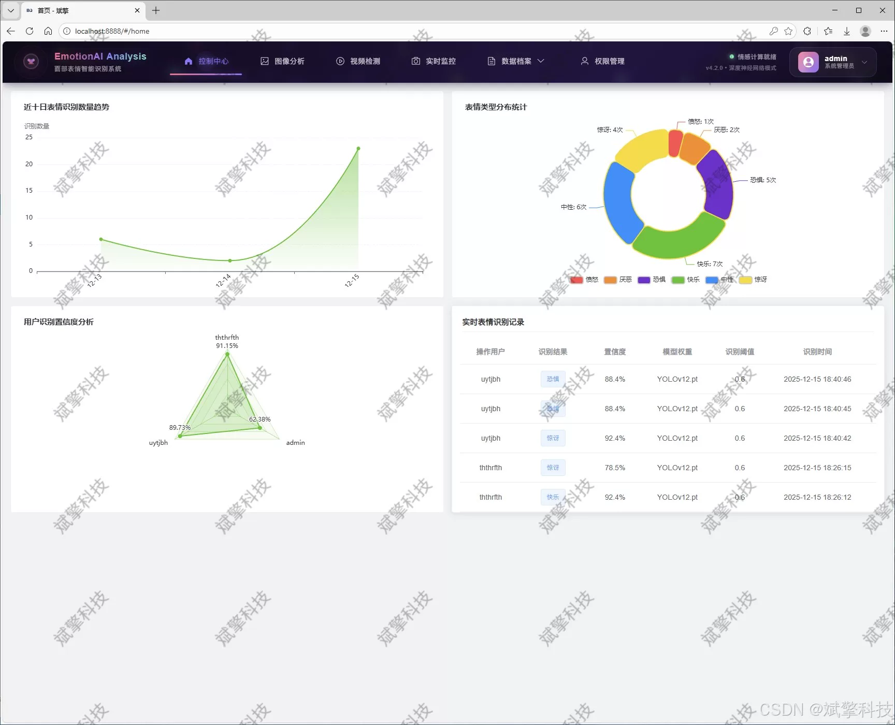
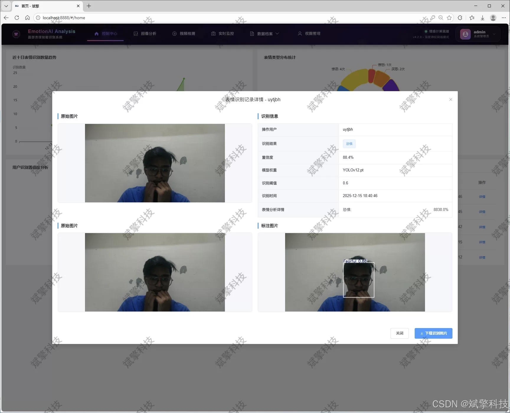
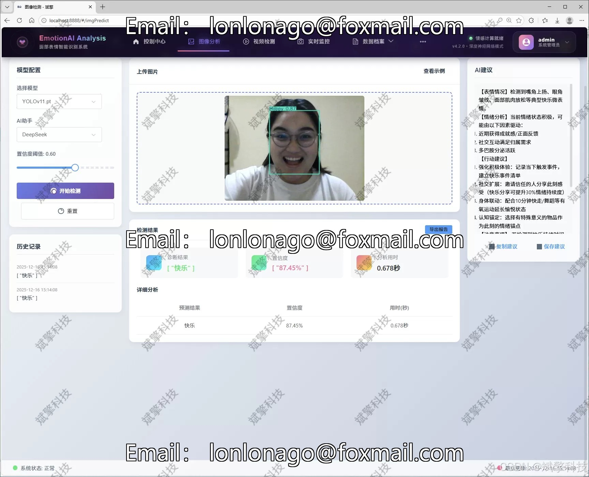
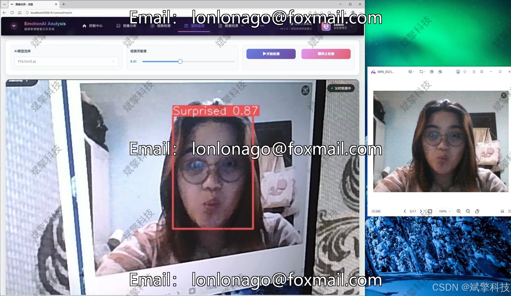
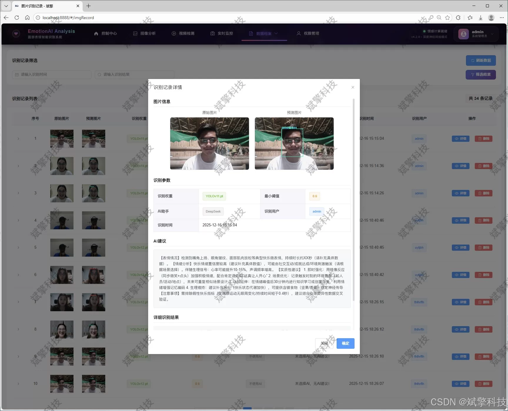
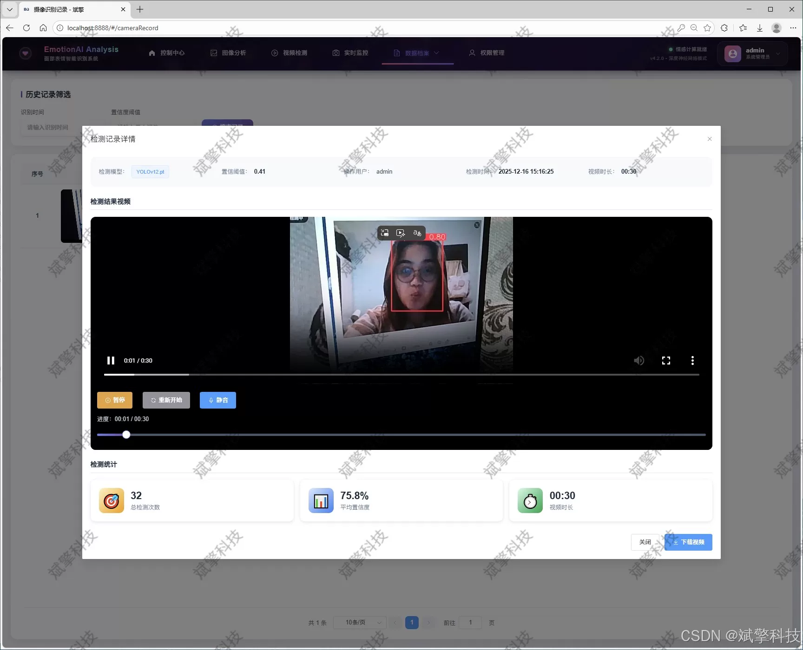
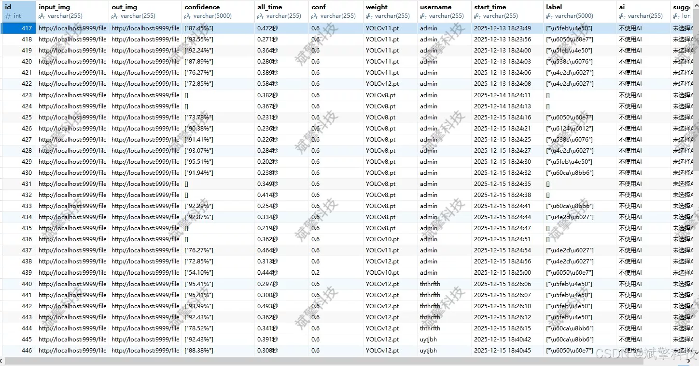

# YOLO+DeepSeek Face Expression Recognition System

## Body

YOLO+DeepSeek is a facial expression recognition system based on YOLO deep learning and the large models of Qianwen and DeepSeek. The system includes DeepSeek intelligent analysis, web interaction interface, front-end and back-end separation, YOLO data, and YOLOv8/YOLOv10/YOLOv11/YOLOv12.

This study designs and implements a high-efficiency, scalable, and user-friendly real-time facial expression recognition system. The core of the system adopts the cutting-edge deep learning object detection architecture - YOLO series models (supporting dynamic switching from YOLOv8 to YOLOv12), trained and optimized on a proprietary dataset containing seven types of expressions including 'anger', 'disgust', 'fear', 'joy', 'neutral', 'sadness', and 'surprise'. To achieve convenient interaction and efficient management, this system innovatively constructs a modern Web application with a front-end based on Vue.js framework providing an intuitive graphical interface, a back-end business logic handled by Spring Boot framework, and the core detection service implemented in Python, ensuring a balance between algorithm performance and system maintainability. The system is comprehensive, supporting online detection and result recording for images, videos, and camera streams, as well as integrating a smart analysis module of the DeepSeek large language model for deep semantic interpretation of detection results. All detection records and user information are persistently stored in a MySQL database, equipped with a complete data visualization dashboard and user management system. Experimental results show that the system achieves excellent recognition accuracy on the test set, and through multi-model support and modular design, provides a powerful and flexible technical platform for research and application in facial expression recognition.

Functional module

✅ Information Visualization, Data Visualization.

✅ Image detection supports AI analysis functions, deepseek and Qianwen.

✅ Supports image detection, video detection, and real-time camera detection. The results are saved to a MySQL database.

✅ Picture recognition record management, video recognition record management and camera recognition record management.

✅ User Management Module, administrators can add, delete, modify, and query users.

✅ Personal center, can modify their own information, password name profile picture and so on.

There is no Lunwen writing service, nor any Lunwen.

## Images

## Payment

Here is a pay link on Stripe ( https://buy.stripe.com/3cs8yP7sY87d0vu9AB ). Please contact me lonlonago@foxmail.com after funding $89, and I will send you a complete data files , thank you!

